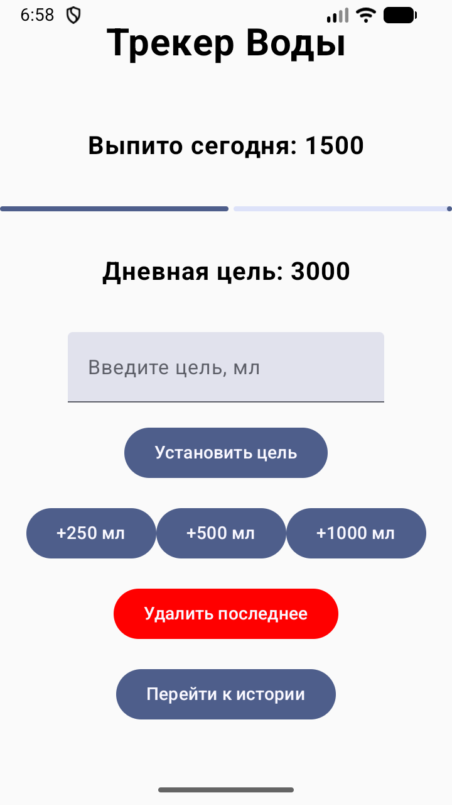
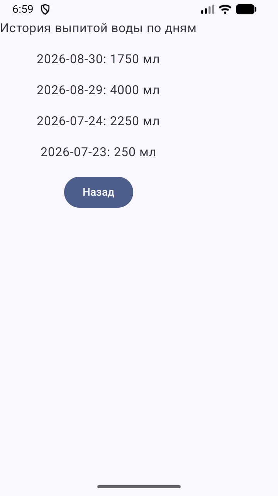

# 💧 Water Tracker

Приложение для учёта выпитой воды за день: добавляешь порции, следишь за прогрессом до цели, смотришь историю по дням.

## Скриншоты

&nbsp;&nbsp;

## Возможности

- Добавление воды в один тап: 250 / 500 / 1000 мл
- Настройка дневной цели
- Индикатор прогресса до цели
- Автосброс счётчика при смене дня
- История по дням
- Удаление последней записи

## Стек

| Категория | Технологии |
|-----------|------------|
| Язык | Kotlin |
| UI | Jetpack Compose, Material 3 |
| Архитектура | MVVM, `UiState` + `StateFlow` |
| DI | Hilt |
| Хранение | Room (история по дням), DataStore (текущее значение и цель) |
| Асинхронность | Coroutines, Flow |

## Архитектура

Разделение на слои, данные текут реактивно снизу вверх:

- **data** — `Room` хранит историю (`WaterDay`), `DataStore` — текущее значение и цель. `WaterRepository` (интерфейс + реализация) объединяет оба источника и отдаёт `Flow`.
- **ui** — `WaterViewModel` держит состояние экрана как единый `WaterUiState` в `StateFlow`; `WaterScreen` / `HistoryScreen` собирают его через `collectAsState`.

Зависимости поставляет Hilt: репозиторий, DataStore и DAO инжектятся через конструкторы, ViewModel — через `@HiltViewModel`.

## Планы

- [ ] Unit-тесты (ViewModel + репозиторий)
- [ ] Напоминания через WorkManager
- [ ] Экран статистики с графиком

## Запуск

Клонировать, открыть в Android Studio, запустить на эмуляторе или устройстве (min SDK 26).
